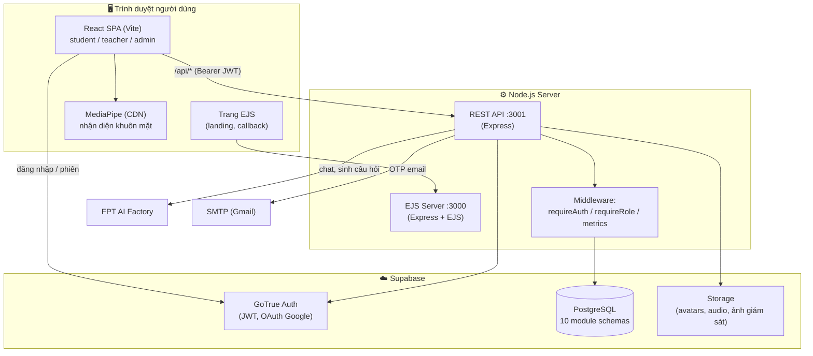
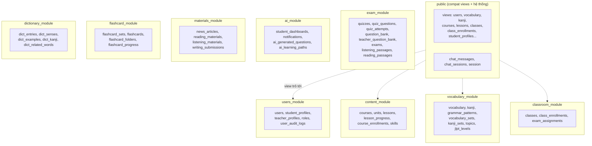
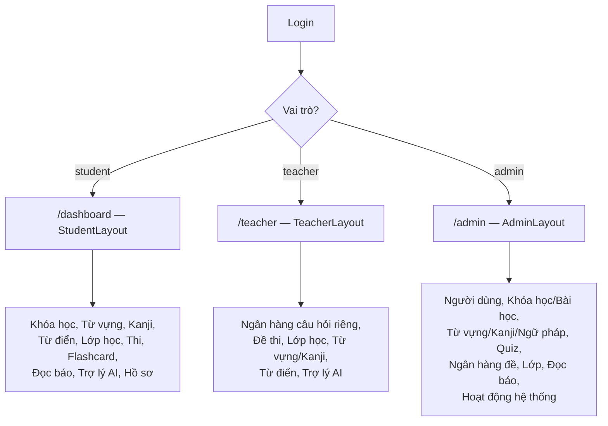
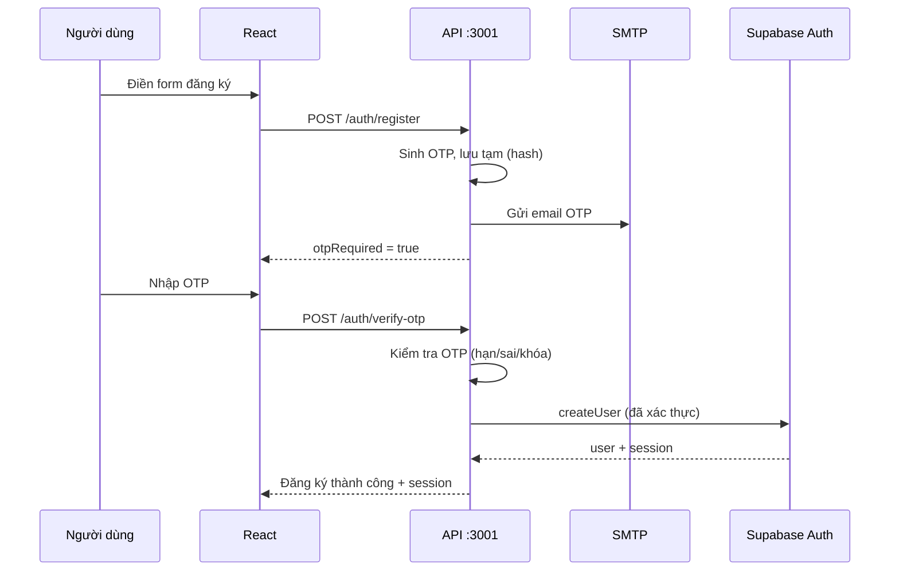
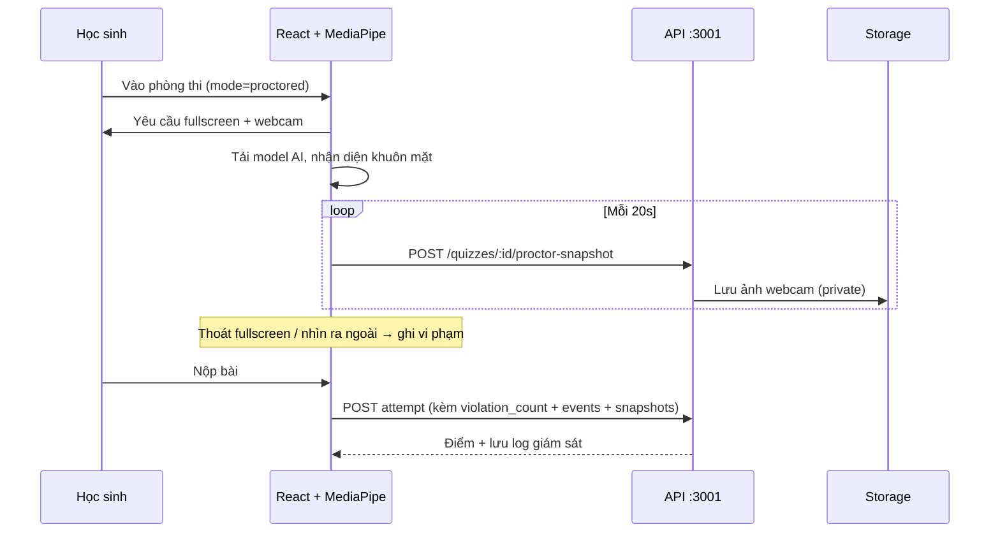

# Kizuna Nihongo — Kiến trúc & Mô tả nghiệp vụ

> Nền tảng học tiếng Nhật (JLPT N5–N1): khóa học, từ vựng, kanji, ngữ pháp, từ điển,
> quiz, thi có giám sát, lớp học, flashcard, luyện đọc báo và trợ lý AI.
> Tài liệu này mô tả toàn bộ kiến trúc hệ thống (package/component diagram) và nghiệp vụ.

---

## 1. Tổng quan công nghệ

| Thành phần | Công nghệ |
|------------|-----------|
| Frontend (SPA chính) | **React + Vite** (port 5173) |
| Web phụ (SSR) | **EJS + Express** (port 3000) — landing, auth callback |
| API backend | **Express REST API** (port 3001) |
| CSDL + Auth + Storage | **Supabase** (PostgreSQL, GoTrue Auth, Storage) |
| Email | **SMTP (Nodemailer)** — gửi OTP đăng ký / quên mật khẩu |
| AI | **FPT AI Factory** (chat, sinh câu hỏi, chấm tự luận, furigana) |
| Giám sát thi | **MediaPipe Tasks Vision** (nhận diện khuôn mặt + hướng nhìn, chạy trên trình duyệt) |
| Phân quyền | Vai trò trong JWT metadata: `student` / `teacher` / `admin` |

---

## 2. Sơ đồ kiến trúc tổng thể (System / Deployment)



---

## 3. Sơ đồ Package (module backend)

```mermaid
flowchart LR
    subgraph Routes["routes/api/*"]
        R_auth[auth]; R_users[users]; R_courses[courses]; R_lessons[lessons]
        R_vocab[vocabulary]; R_kanji[kanji]; R_grammar[grammar]; R_dict[dictionary]
        R_quiz[quizzes]; R_exam[exams]; R_class[classes]; R_flash[flashcards]
        R_news[news]; R_ai[ai]; R_admin[admin]; R_teacher[teacher]
    end

    subgraph Controllers["controllers/*"]
        C_auth[authController]; C_user[userController]; C_course[courseController]
        C_lesson[lessonController]; C_vocab[vocabularyController]; C_kanji[kanjiController]
        C_grammar[grammarController]; C_dict[dictionaryController]; C_quiz[quizController]
        C_exam[examController]; C_class[classController]; C_flash[flashcardController]
        C_news[newsController]; C_admin[adminController]; C_teacher[teacherController]
        C_tqb[teacherQuestionBankController]
    end

    subgraph Config["config/ + middleware/"]
        CFG_sb[supabase client]; CFG_ai[ai - FPT]; CFG_mail[mailer - SMTP]
        CFG_audio[audio - ffmpeg/VAD]; MW_auth[auth middleware]; MW_metric[metrics]
    end

    Routes --> Controllers --> Config
```



> Mỗi route gắn với 1 controller; controller dùng các client chung trong `config/`
> (Supabase, AI, mailer) và `middleware/` (xác thực, đo lưu lượng).

---

## 4. Cấu trúc CSDL theo module (PostgreSQL schemas)

Database được **tách thành các schema theo module**. Schema `public` chứa **compatibility views**
(ánh xạ tên cột cũ ↔ mới) để backend truy cập đồng nhất qua một lớp tương thích.



> **Lưu ý kỹ thuật:** sau đợt tái cấu trúc, một số bảng đổi tên cột (vd `enrollment_key→invite_code`,
> `kanji→word`, `level→jlpt_level_id`). Lớp **compat view + INSTEAD OF trigger** trong `public` giữ cho
> code/frontend cũ chạy nguyên trên cấu trúc mới. PostgREST expose các schema được dùng trực tiếp
> (exam_module, classroom_module, content_module, ...).

---

## 5. Phân quyền & điều hướng theo vai trò



| Route guard | Cho phép | Nếu sai vai trò |
|-------------|----------|-----------------|
| `StudentRoute` | chỉ student | admin→/admin, teacher→/teacher |
| `TeacherRoute` | teacher + admin | →/dashboard |
| `AdminRoute` | chỉ admin | →/dashboard |
| `ProtectedRoute` | mọi user đã đăng nhập | →/login |

`/chat` (Trợ lý AI) và `/profile` (Hồ sơ) dùng chung mọi vai trò — layout hiển thị theo role.

---

## 6. Mô tả nghiệp vụ theo domain

### 6.1. Xác thực & Tài khoản (`auth`, `users`)
- **Đăng ký bằng OTP qua SMTP**: nhập thông tin → backend sinh OTP 6 số, gửi email → người dùng
  nhập OTP → tài khoản mới được tạo. OTP hash SHA-256, hết hạn 10 phút, tối đa 5 lần sai, cooldown gửi lại 60s.
- **Quên mật khẩu bằng OTP** (cùng cơ chế email với đăng ký): nhập email → nhận OTP → nhập OTP + mật khẩu mới.
- **Đăng nhập Google OAuth** (qua Supabase).
- **Đổi mật khẩu trong hồ sơ**: yêu cầu nhập mật khẩu hiện tại để xác thực trước khi đổi.
- Trigger `handle_new_user` tự tạo bản ghi `users`, `student_profiles`, `student_dashboards`.

### 6.2. Khóa học — Bài học (`courses`, `lessons`, `grammar`)
- Phân cấp: **Khóa học (course) → Bài học (unit) → Mục (lesson)**.
- Mỗi Mục có thể là: đọc hiểu, video, ngữ pháp, từ vựng, kanji, quiz.
- Học sinh học theo thứ tự, có điều hướng tiếp/trước, đánh dấu hoàn thành (`lesson_progress`).
- Admin quản lý nội dung qua "Course Builder" (`ManageCourseContent`).

### 6.3. Từ vựng & Kanji (`vocabulary`, `kanji`)
- CRUD + import hàng loạt (tối đa 500 dòng/lần), gắn theo trình độ JLPT.
- Kanji có âm on/kun, âm Hán-Việt, số nét; upsert theo ký tự (không trùng).
- Hiển thị furigana (AI annotate).

### 6.4. Từ điển Nhật-Việt (`dictionary`)
- Tra theo kanji/kana/romaji/nghĩa tiếng Việt (RPC xếp hạng theo độ khớp).
- Chi tiết từ: nghĩa, ví dụ, phân tích từng chữ Hán (âm Hán-Việt), từ liên quan.
- Dữ liệu import offline từ nguồn ngoài (JMdict, Tatoeba...).

### 6.5. Quiz & Ngân hàng đề (`quizzes`, question bank)
- Quiz gắn theo bài học; câu hỏi tạo thủ công **hoặc** nhập từ ngân hàng đề.
- Nhiều loại: trắc nghiệm 1/nhiều đáp án, nối, sắp xếp, điền khuyết, tự luận.
- **2 chế độ thi**: *Thường* và *Giám sát*.

### 6.6. Thi có giám sát (`exams`, proctored)
- Giáo viên tạo đề (lưu trong `quizzes` với `is_exam=true`), giao cho lớp (`exam_assignments`)
  với thời gian mở/đóng + số lần làm.
- Học sinh làm bài; chế độ **giám sát** kích hoạt: bắt buộc toàn màn hình, bật webcam.
- **AI nhận diện khuôn mặt** (MediaPipe) phát hiện: không có mặt / nhiều người / không nhìn màn hình.
- Vi phạm (thoát fullscreen, rời tab, mất webcam, nhìn ra ngoài) được **đếm + ghi log**;
  ảnh webcam chụp định kỳ lưu Storage (bucket riêng tư), giáo viên xem lại kèm signed URL.
- Chấm tự động cho trắc nghiệm; câu tự luận → trạng thái chờ chấm, có **gợi ý chấm bằng AI**.

### 6.7. Lớp học (`classes`)
- Giáo viên tạo lớp (mã mời tự sinh), quản lý học viên (kích hoạt/vô hiệu/xóa).
- Học sinh tham gia bằng mã, xem lớp đã vào, rời lớp.
- Admin xem toàn bộ lớp.

### 6.8. Flashcard (`flashcards`)
- Học sinh tạo bộ thẻ, thư mục, học theo chế độ lật thẻ, theo dõi tiến độ.

### 6.9. Luyện đọc báo (`news`)
- Admin sinh bài đọc (AI chia đoạn + furigana); học sinh đọc, tra từ.

### 6.10. Trợ lý AI (`ai` / ChatPage)
- Chat hỏi đáp tiếng Nhật (từ vựng, kanji, ngữ pháp), có lịch sử phiên,
  đính kèm ảnh, gợi ý từ/kanji liên quan dạng chip mở chi tiết.

### 6.11. Quản trị hệ thống (`admin`)
- Dashboard: thống kê, hoạt động gần đây, **biểu đồ lưu lượng/hiệu năng thật** (middleware metrics).
- Trang "Hoạt động hệ thống": ping Backend/DB/AI, **card test nhận diện khuôn mặt** cho thi giám sát.
- Duyệt nội dung giáo viên gửi (vocab/kanji submissions).

---

## 7. Luồng nghiệp vụ tiêu biểu (Sequence)

### 7.1. Đăng ký bằng OTP


### 7.2. Làm bài thi có giám sát


---

## 8. Sơ đồ thư mục dự án (rút gọn)

```
swp/
├── server.js, app.js          # EJS server :3000 (landing, auth callback)
├── routes/, views/            # EJS routes + templates
├── backend/                   # REST API :3001
│   ├── app.js, server.js
│   ├── routes/api/*           # 16 nhóm route
│   ├── controllers/*          # 16 controller nghiệp vụ
│   ├── config/                # supabase, ai (FPT), mailer (SMTP), audio (VAD/ffmpeg)
│   └── middleware/            # auth (role guard), metrics
├── frontend/                  # React SPA :5173
│   └── src/
│       ├── pages/{public,student,teacher,admin,shared}
│       ├── components/{ui,layout,admin,dictionary}
│       ├── contexts/          # AuthContext, LangContext
│       └── lib/               # api (axios), supabase, useProctoring, faceDetector
└── database/                  # schema.sql, migrate.sql
```

---

## 9. Tích hợp ngoài & lưu ý vận hành

| Dịch vụ | Dùng cho | Cấu hình (.env) |
|---------|----------|-----------------|
| Supabase | DB, Auth, Storage | `SUPABASE_URL`, `SUPABASE_SERVICE_ROLE_KEY`, `SUPABASE_ANON_KEY` |
| SMTP (Gmail) | Email OTP | `SMTP_HOST/PORT/USER/PASS/FROM` |
| FPT AI Factory | Chat, sinh câu hỏi, chấm AI, furigana | `FPT_AI_API_KEY`, `FPT_AI_MODEL`, `FPT_AI_WHISPER_MODEL` |

- **Webcam + fullscreen** (thi giám sát) yêu cầu **HTTPS** hoặc `localhost`.
- Ảnh giám sát lưu bucket **private**, truy cập qua **signed URL** sinh từ backend.
- Storage buckets: `avatars`, `listening-passages-audio`, `proctor-snapshots`.

